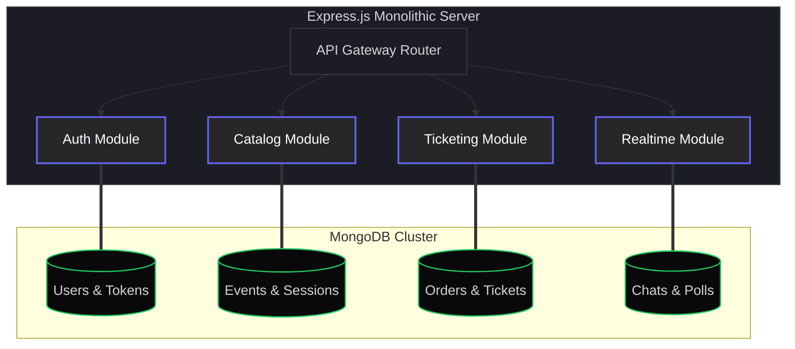
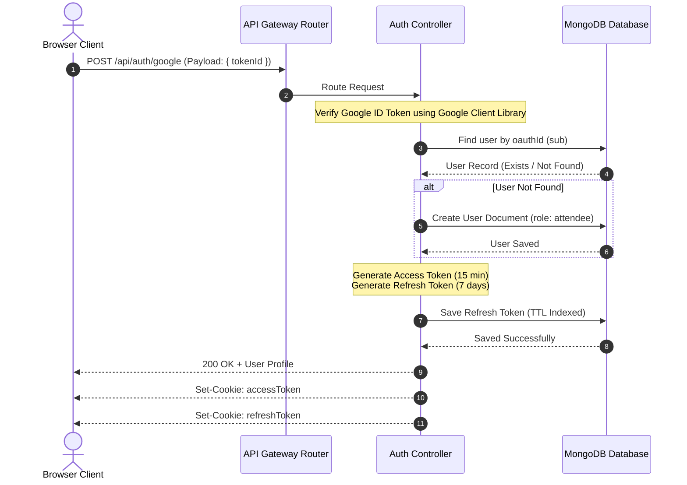
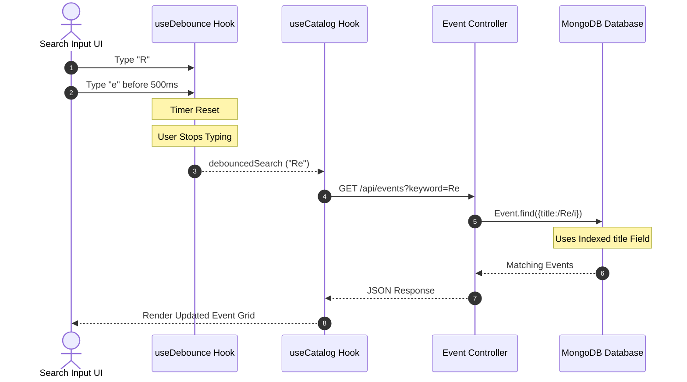
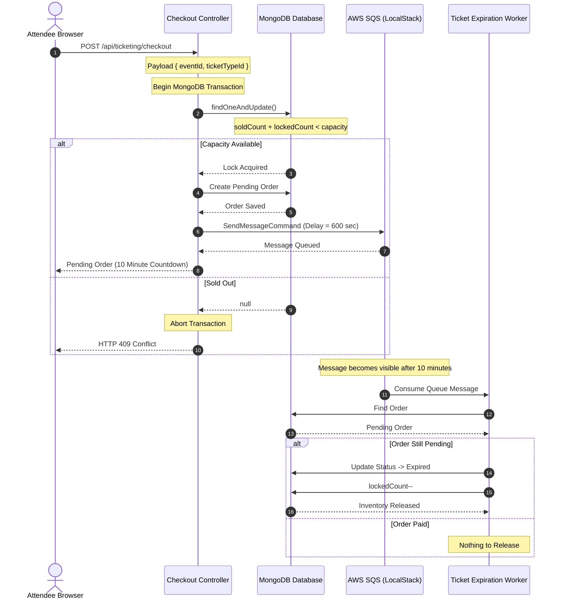
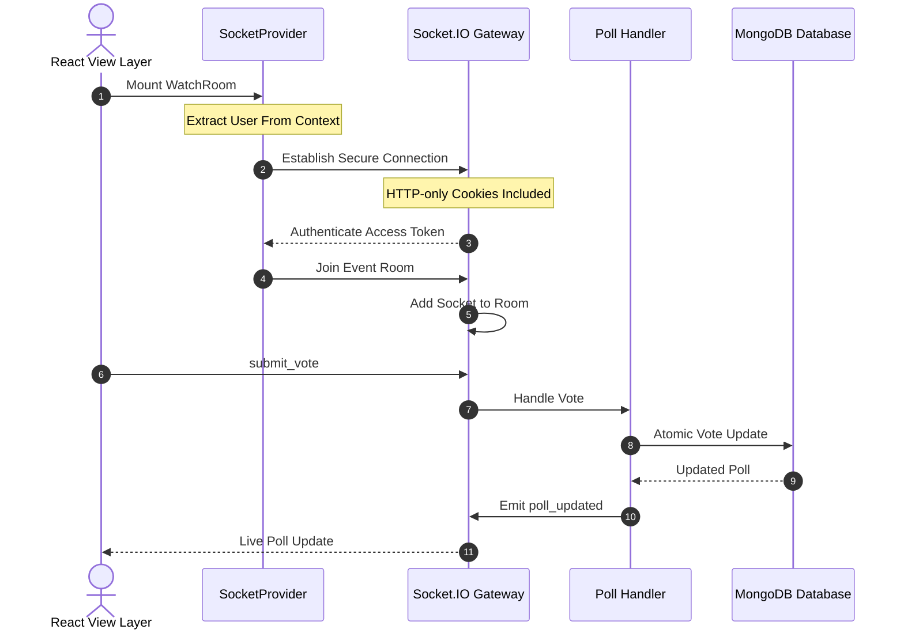
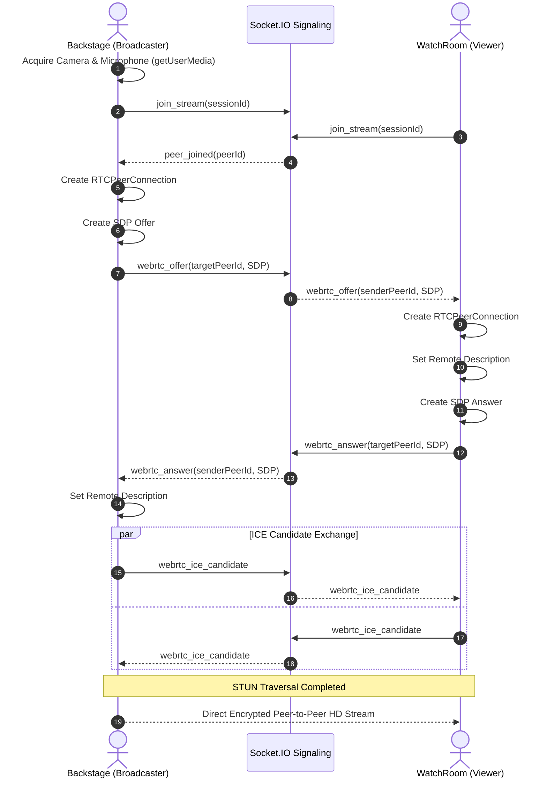

# Enterprise Virtual Event Platform

<p align="center">


</p>

A **high-performance**, **modular monolithic** web application engineered to host premium virtual events, manage transactional ticket inventory under concurrent load, and facilitate real-time attendee interactions using secure **WebSockets** and near-zero latency **WebRTC** streaming.

---

# Table of Contents

- [System Architecture](#1-system-architecture-the-modular-monolith)
- [Architectural Rules of Isolation](#architectural-rules-of-isolation)
- [Core Feature Workflows](#2-core-feature-workflows--lifecycles)
  - Authentication Lifecycle
  - Event Search
  - Ticket Reservation
  - Real-Time Communication
  - WebRTC Streaming
- [Environment Variables](#3-environment-variables-guide)
- [Setup & Installation](#4-setup--installation-guide)
- [Architectural Health Checks](#5-architectural-health-checks)

---

# Technologies Used

## Backend

- Node.js
- Express.js
- MongoDB
- Mongoose

## Authentication

- JWT
- Google OAuth
- HTTP-only Cookies

## Realtime

- Socket.IO
- WebRTC

## Infrastructure

- Docker
- Docker Compose
- AWS SQS (LocalStack)

---

# 1. System Architecture: The Modular Monolith

Rushing into a distributed microservices setup early in a product's lifecycle introduces complex distributed tracing, network latency overhead, and significant deployment complexity.

The **Virtual Event Platform** addresses these hurdles by adopting a **Modular Monolith Architecture**, where each business domain is isolated into its own module while remaining within a single deployment unit.



---

# Architectural Rules of Isolation

To emulate the maintainability of microservices while preserving the simplicity of a single deployment, the application follows strict architectural boundaries.

## 1. Directory-Level Isolation

Each business capability resides inside an isolated module.

```
modules/
│
├── auth/
├── catalog/
├── ticketing/
└── realtime/
```

---

## 2. No Cross-Database References

Mongoose `ref` relationships across modules are intentionally forbidden.

For example, `Order.js` stores the attendee identifier as a plain `ObjectId` rather than:

```javascript
ref: "User"
```

This prevents hidden coupling between domains.

---

## 3. API Composition Between Modules

Whenever one module requires information owned by another module, it communicates through the module's public interface instead of directly importing database models.

Example:

```javascript
import * as authModule from "../../auth/index.js";

const organizerDetails = await authModule.getUserById(
    event.createdBy
);
```

This preserves loose coupling and allows future extraction into independent microservices with minimal refactoring.

---

# 2. Core Feature Workflows & Lifecycles

The following sections describe the complete lifecycle of every critical feature implemented in the platform.

Each workflow includes:

- Architectural reasoning
- Sequence diagrams
- Implementation strategy
- Database interactions
- Security considerations
- Performance optimizations

## Flow A: Secured Identity & Token Rotation Lifecycle (Auth Module)

To protect against both **Cross-Site Scripting (XSS)** and **Cross-Site Request Forgery (CSRF)** attack vectors, the authentication system implements **double-layered token security** through cryptographically rotated JWTs stored in **HTTP-Only cookies**.

---

### Authentication Lifecycle



---

### OAuth Verification

The React frontend authenticates users through the **Google Identity Services SDK**.

After successful authentication, Google returns an **ID Token**.

The frontend forwards this token to the backend:

```http
POST /api/auth/google
```

Request body:

```json
{
    "tokenId": "<google-id-token>"
}
```

---

### Backend Authentication

The backend receives the Google token and validates it using Google's public key certificate via the official **google-auth-library**.

If validation succeeds:

1. Search for the user using the Google `sub` field.
2. Create a new account if the user doesn't already exist.
3. Generate authentication tokens.
4. Persist the refresh token.
5. Return the authenticated user.

---

### Session Provisioning

After successful authentication, the server generates two independent JWTs.

| Token | Expiration | Purpose |
|--------|-----------|---------|
| Access Token | 15 Minutes | Authenticate API requests |
| Refresh Token | 7 Days | Generate new Access Tokens |

---

### Refresh Token Storage

Unlike the Access Token, the Refresh Token is also persisted inside MongoDB.

The collection uses a **TTL (Time-To-Live) Index**, allowing MongoDB to automatically delete expired refresh tokens without manual cleanup jobs.

---

### HTTP-Only Cookie Injection

Both tokens are returned using secure cookies.

```
Set-Cookie: accessToken
Set-Cookie: refreshToken
```

Cookie Configuration:

- HttpOnly
- Secure
- SameSite=Strict

Because the browser prevents JavaScript from accessing these cookies, they remain protected against common **XSS attacks**.

---

### Security Advantages

This design provides multiple layers of protection.

#### Against XSS

JavaScript cannot access authentication tokens.

Even if malicious scripts execute inside the browser, they cannot steal the JWT.

---

#### Against CSRF

Using

```
SameSite=Strict
```

prevents browsers from automatically attaching cookies during cross-site requests.

---

#### Refresh Token Rotation

Because Refresh Tokens are stored in MongoDB, they can be revoked at any time.

Examples:

- Logout
- Password Reset
- Suspicious Activity
- Account Suspension

Unlike stateless JWT-only systems, this provides complete session invalidation.

---

### Authentication Flow Summary

1. User signs in with Google.
2. React receives Google ID Token.
3. Backend verifies token.
4. User is created if necessary.
5. Access Token generated (15 min).
6. Refresh Token generated (7 days).
7. Refresh Token stored in MongoDB.
8. Both tokens sent via HTTP-Only cookies.
9. Browser automatically includes cookies in future requests.
10. Protected routes validate Access Token before granting access.

---

## Flow B: Case-Insensitive Debounced Event Search (Catalog Module)

Searching the event catalog is one of the most frequently executed operations in the platform.

Sending an HTTP request on every key press would overload both the frontend and backend.

To mitigate this, the platform combines **client-side debouncing** with **indexed MongoDB searches**.

---

### Search Lifecycle



---

### Client-Side Debouncing

When the attendee types into the search field, every keystroke restarts a timer.

If another key is pressed before **500 milliseconds**, the previous timer is cancelled.

Implementation:

```javascript
return () => clearTimeout(timer);
```

This cleanup function executes automatically inside `useEffect`, preventing unnecessary HTTP requests.

---

### Search Execution

Only after the user pauses typing for **500 milliseconds** does the hook update its debounced value.

That change triggers the `useCatalog()` hook to execute:

```http
GET /api/events?keyword=React
```

---

### Database Query

The backend performs a case-insensitive regular expression search.

```javascript
Event.find({
    title: /React/i,
    status: "published"
});
```

---

### Database Optimization

The `title` field inside the Event schema is indexed.

```javascript
title: {
    type: String,
    index: true
}
```

This allows MongoDB to evaluate the search using its B-Tree index rather than scanning every document.

Approximate complexity:

```
O(log N)
```

instead of

```
O(N)
```

---

### Catalog Search Summary

1. User begins typing.
2. Debounce timer starts.
3. New keystroke cancels previous timer.
4. User pauses for 500ms.
5. HTTP request dispatched.
6. Backend performs indexed regex search.
7. Matching events returned.
8. React automatically re-renders the event grid.

## Flow C: Double-Booking Protection & SQS Release Loop (Ticketing Module)

When high-demand events go live, hundreds of users may attempt to reserve the same ticket simultaneously. Without proper concurrency control, this can result in **overselling** or **double-booking**.

The Ticketing module prevents these race conditions by combining:

- **MongoDB Atomic Operations**
- **Mongoose Transactions**
- **Pessimistic Inventory Locking**
- **Delayed AWS SQS Messages**
- **Asynchronous Inventory Release Workers**

---

### Ticket Reservation Lifecycle



---

### Why Atomic Locking?

Consider the following scenario:

Ticket Capacity:

```
100
```

Remaining Tickets:

```
1
```

Now imagine **two users** click **Purchase** at exactly the same moment.

Without atomic updates:

User A checks availability ✔

User B checks availability ✔

User A purchases ✔

User B purchases ✔

Now:

```
101 tickets sold
```

This is a classic **race condition**.

---

### Atomic Reservation

Instead of performing:

```javascript
find()

update()
```

as two independent operations, the platform performs both actions atomically using `findOneAndUpdate()`.

```javascript
const updatedType = await TicketType.findOneAndUpdate(
  {
    _id: ticketTypeId,
    $expr: {
      $lt: [
        {
          $add: [
            "$soldCount",
            "$lockedCount"
          ]
        },
        "$capacity"
      ]
    }
  },
  {
    $inc: {
      lockedCount: 1
    }
  },
  {
    new: true
  }
);
```

MongoDB guarantees that this operation executes atomically.

No second request can modify the same document in between.

---

### Pending Order Creation

After successfully locking inventory, a pending order is created.

Example:

```text
Status: pending

Expires At:
Current Time + 10 Minutes
```

The attendee now has **10 minutes** to complete payment.

---

### Delayed SQS Queue

Immediately after creating the order, the backend publishes a delayed message.

```javascript
SendMessageCommand({
    DelaySeconds: 600
})
```

Instead of polling the database every few seconds, AWS SQS automatically delays delivery.

Advantages:

- No cron jobs
- No polling
- Minimal CPU usage
- Horizontally scalable

---

### Ticket Expiration Worker

Exactly **10 minutes** later, the message becomes visible.

The worker consumes it.

Workflow:

1. Find Order
2. Check Status

If:

```
pending
```

then:

```text
status = expired
```

and

```text
lockedCount--
```

The ticket instantly becomes available for purchase again.

If:

```
paid
```

the worker simply deletes the queue message.

---

### Why This Design?

Instead of repeatedly checking every order:

```
Every Minute

↓

SELECT pending orders

↓

Check expiration
```

the queue guarantees **exact execution** only when needed.

Benefits:

- Better scalability
- Lower database load
- Predictable execution
- Event-driven architecture

---

### Ticketing Flow Summary

1. User starts checkout.
2. MongoDB transaction begins.
3. Atomic inventory lock acquired.
4. Pending order created.
5. Delayed SQS message published.
6. User receives 10-minute reservation.
7. User either pays or abandons checkout.
8. Worker consumes delayed message.
9. Inventory released automatically if payment never occurs.

---

## Flow D: Real-Time State-Synced Interactivity (WebSockets)

Persistent real-time interactions such as:

- Live Chats
- Interactive Polls
- Audience Participation

are powered by a secure **Socket.IO Gateway**.

Unlike REST APIs, WebSockets maintain a persistent bidirectional connection between client and server.

---

### WebSocket Lifecycle



---

### Secure Connection Handshake

When the WatchRoom component mounts, the SocketProvider establishes a WebSocket connection.

Configuration:

```javascript
withCredentials: true
```

Because authentication uses HTTP-only cookies, the browser automatically includes them during the initial WebSocket handshake.

No JWT is ever exposed to frontend JavaScript.

---

### Token Verification

Socket.IO middleware extracts the cookies.

The backend verifies the Access Token.

If valid:

```javascript
socket.user = decodedUser;
```

Every future socket event now has access to the authenticated user.

---

### Room-Based Communication

Instead of broadcasting events globally, every attendee joins a room.

Example:

```text
event_777
```

```javascript
socket.join(`event_${eventId}`);
```

Only attendees inside that room receive updates.

---

### Live Poll Voting

When a participant votes:

```text
submit_vote
```

the backend performs an atomic MongoDB update.

```javascript
const updatedPoll = await Poll.findOneAndUpdate(
  {
    _id: pollId,
    "options._id": optionId
  },
  {
    $inc: {
      "options.$.votes": 1
    },
    $push: {
      votedUsers: userId
    }
  },
  {
    new: true
  }
);
```

This guarantees:

- Vote count increments atomically.
- User ID is stored.
- Duplicate voting is prevented.

---

### Broadcasting Updates

After MongoDB returns the updated poll, the gateway broadcasts it to every attendee currently watching the event.

```javascript
io.to(`event_${eventId}`).emit(
    "poll_updated",
    {
        _id: updatedPoll._id,
        options: updatedPoll.options
    }
);
```

React clients immediately receive the updated poll and re-render the live voting bars without refreshing the page.

---

### Why Socket.IO?

Socket.IO provides:

- Automatic reconnection
- Room support
- Event-based communication
- Transport fallback
- Low-latency updates
- Secure cookie-based authentication

This makes it ideal for real-time event experiences where attendees expect instant feedback.
---

## Flow E: Near-Zero Latency WebRTC Video Streaming

Traditional live streaming platforms route every audio and video packet through centralized media servers, introducing additional latency and infrastructure costs.

To achieve **near-zero latency broadcasting**, the Virtual Event Platform establishes **direct peer-to-peer (P2P)** connections between broadcasters and viewers using **WebRTC**, while **Socket.IO** acts solely as the signaling channel.

---

### Streaming Lifecycle



---

### Device Access

When a broadcaster enters the backstage area, the browser requests permission to access the local camera and microphone.

```javascript
navigator.mediaDevices.getUserMedia({
    video: true,
    audio: true
});
```

The returned media stream is attached to the broadcaster's local preview, allowing them to monitor their own video before the stream begins.

---

### Session Initialization

Both the broadcaster and viewers join the same streaming session.

```text
join_stream(sessionId)
```

The signaling server coordinates which peers should connect but **never transports the media itself**.

---

### SDP Negotiation

Once a viewer joins, the broadcaster creates a new `RTCPeerConnection`.

The broadcaster generates an **SDP (Session Description Protocol) Offer**, which contains:

- Supported video codecs
- Audio codecs
- Encryption capabilities
- Connection parameters

The offer is transmitted through the Socket.IO signaling server.

```text
Broadcaster
        ↓
Socket.IO
        ↓
Viewer
```

---

### SDP Answer

The viewer:

1. Creates its own `RTCPeerConnection`
2. Loads the received SDP Offer
3. Generates an SDP Answer
4. Sends the answer back through Socket.IO

Once the broadcaster receives the answer, both peers possess the information required to establish a direct media connection.

---

### ICE Candidate Exchange

Although both peers know how to communicate, they still need to discover a valid network path.

This is achieved by exchanging **ICE (Interactive Connectivity Establishment)** candidates.

Both browsers gather:

- Local IP addresses
- Public IP addresses
- Available network interfaces
- NAT mappings

These candidates are exchanged through Socket.IO until a working path is found.

---

### STUN Traversal

Most users sit behind routers performing Network Address Translation (NAT).

To discover their public-facing address, each browser queries a **STUN server**.

Once both peers exchange their discovered addresses, WebRTC attempts multiple connection strategies until one succeeds.

---

### Direct Peer-to-Peer Streaming

After ICE negotiation completes successfully:

- Audio packets
- Video packets

flow **directly** between browsers.

The application server is completely bypassed.

```text
Broadcaster
        ⇄
      Viewer
```

Advantages:

- Extremely low latency (typically under 200 ms)
- Reduced bandwidth costs
- Lower server load
- End-to-end encrypted media transport

---

### Why Socket.IO Is Still Required

A common misconception is that WebRTC alone establishes connections.

In reality, browsers have no built-in mechanism to discover one another.

Socket.IO provides the signaling channel responsible for exchanging:

- SDP Offers
- SDP Answers
- ICE Candidates
- Join notifications
- Peer discovery events

Once signaling completes successfully, Socket.IO is no longer involved in transporting media.

---

### WebRTC Flow Summary

1. Broadcaster opens camera and microphone.
2. Broadcaster joins the streaming session.
3. Viewer joins the same session.
4. Socket.IO notifies the broadcaster.
5. Broadcaster creates an SDP Offer.
6. Viewer responds with an SDP Answer.
7. Both peers exchange ICE Candidates.
8. STUN servers assist in NAT traversal.
9. A direct encrypted P2P connection is established.
10. Live HD audio and video stream with near-zero latency.

---
---

# 3. Environment Variables Guide

The system configuration is driven entirely by environment variables loaded from the `.env` file during server startup.

The table below explains every variable found in `.env.example`.

| Category | Environment Variable | Description |
|-----------|----------------------|-------------|
| **Docker** | `COMPOSE_PROJECT_NAME` | Project identifier used by Docker Compose to namespace containers, networks, and volumes. |
| **Application** | `NODE_ENV` | Specifies the runtime environment (`development`, `production`, etc.). |
| **Backend** | `PORT` | Internal port on which the Express server listens. |
| **Host Ports** | `HOST_PORT_BACKEND` | Host machine port mapped to the backend container. |
| | `HOST_PORT_MONGO` | Host machine port mapped to MongoDB. |
| **Database** | `MONGO_URI` | MongoDB connection string. Inside Docker this resolves to `mongodb://mongo:27017/...`; outside Docker it typically points to `mongodb://127.0.0.1:27018/...`. |
| **JWT** | `JWT_ACCESS_SECRET` | Secret used to cryptographically sign Access Tokens. |
| | `JWT_REFRESH_SECRET` | Secret used to cryptographically sign Refresh Tokens. |
| **OAuth** | `GOOGLE_CLIENT_ID` | Google OAuth Client ID obtained from Google Cloud Console. |
| | `GOOGLE_CLIENT_SECRET` | Google OAuth Client Secret. |
| **AWS SQS** | `AWS_REGION` | AWS region used by the SQS client. |
| | `AWS_ACCESS_KEY_ID` | LocalStack or AWS Access Key. |
| | `AWS_SECRET_ACCESS_KEY` | LocalStack or AWS Secret Key. |
| | `SQS_ENDPOINT` | Endpoint used by the SQS client. During development this points to LocalStack (`http://aws:4566` in Docker or `http://127.0.0.1:4566` locally). |
| | `SQS_TICKET_EXPIRATION_QUEUE_URL` | URL of the delayed queue responsible for releasing expired ticket reservations. |
| **Payments** | `SAFEPAY_ENVIRONMENT` | Payment gateway environment (`sandbox` during development). |
| | `SAFEPAY_API_KEY` | Safepay API key. |
| | `SAFEPAY_WEBHOOK_SECRET` | Secret used to validate incoming payment webhooks. |

---

# 4. Setup & Installation Guide

Follow the steps below to configure the complete development environment.

---

## Prerequisites

Before starting, ensure the following software is installed:

- Node.js **v18.x** or higher
- Docker
- Docker Compose

---

## Step 1 — Clone the Repository

```bash
git clone <repository-url>

cd server
```

---

## Step 2 — Configure Environment Variables

Copy the example configuration:

```bash
cp .env.example .env
```

Open the newly created `.env` file and update the configuration values.

If you're running the backend directly on your host machine instead of inside Docker, update the following variables:

### MongoDB

```env
MONGO_URI=mongodb://127.0.0.1:27018/virtual-events
```

### LocalStack Endpoint

```env
SQS_ENDPOINT=http://127.0.0.1:4566
```

### Queue URL

```env
SQS_TICKET_EXPIRATION_QUEUE_URL=http://127.0.0.1:4566/000000000000/TicketReleaseQueue
```

---

## Step 3 — Start Infrastructure Services

Launch MongoDB and LocalStack in detached mode.

```bash
docker compose up -d
```

This starts:

- MongoDB
- LocalStack (AWS Emulator)

---

## Step 4 — Create the Ticket Expiration Queue

Because LocalStack is an ephemeral development environment, its SQS service starts with no queues.

Create the delayed expiration queue:

```bash
docker exec virtual-events-aws \
awslocal sqs create-queue \
--queue-name TicketReleaseQueue
```

---

## Step 5 — Install Dependencies

Install all backend packages.

```bash
npm install
```

---

## Step 6 — Start the Development Server

Run the backend:

```bash
npm run dev
```

---

## Step 7 — Verify Successful Startup

A successful initialization should produce console output similar to:

```text
[2026-07-01 14:15:00] INFO: MongoDB Connected: 127.0.0.1

[2026-07-01 14:15:01] INFO: LocalStack SQS Queue verified/created successfully

[2026-07-01 14:15:01] INFO: Safepay initialized in SANDBOX mode

[2026-07-01 14:15:01] INFO: Ticket Expiration SQS Worker started successfully

[2026-07-01 14:15:01] INFO: Server successfully initialized on port: 5000
```

If all services initialize successfully, the backend is ready for development.

---

# 5. Architectural Health Checks

The Virtual Event Platform incorporates several architectural practices to maintain performance, scalability, and clean code as the application grows.

---

## Memory Leak Protection

Persistent real-time resources are cleaned up correctly when React components unmount.

Examples include:

- Removing Socket.IO listeners

```javascript
socket.off(...)
```

- Stopping media tracks

```javascript
track.stop()
```

These cleanup routines prevent:

- Memory leaks
- Duplicate event handlers
- Camera and microphone resource leaks

---

## Database Optimization

MongoDB indexes are used on frequently queried fields to avoid full collection scans.

Additionally, Mongoose's `.lean()` method is used whenever documents do not require model functionality.

Benefits include:

- Lower memory usage
- Faster query execution
- Improved response times

Indexed lookups generally execute in approximately:

```text
O(log N)
```

instead of

```text
O(N)
```

---

## Thread Safety

Concurrent operations rely on MongoDB's atomic update operators.

Examples include:

- `$inc`
- `findOneAndUpdate()`

These operations guarantee thread-safe inventory updates and prevent race conditions during ticket reservations.

---

## Security Against XSS

Authentication credentials are stored inside **HTTP-Only cookies**.

As a result:

- Client-side JavaScript cannot read JWTs.
- Authentication tokens remain protected from XSS attacks.
- The browser automatically includes credentials on authenticated requests.

This significantly strengthens the platform's authentication pipeline while keeping the developer experience simple.

---

# Conclusion

The Enterprise Virtual Event Platform demonstrates a production-oriented backend architecture that combines:

- Modular Monolith design
- Secure JWT authentication with token rotation
- Google OAuth integration
- MongoDB transactions and atomic operations
- Event-driven ticket reservation with AWS SQS
- Real-time communication using Socket.IO
- Near-zero latency video streaming with WebRTC
- Dockerized development infrastructure
- Performance-focused database optimization
- Security best practices against XSS and CSRF

The architecture is intentionally designed so that each module can evolve independently, allowing the system to scale toward a microservices architecture in the future with minimal refactoring.

---
